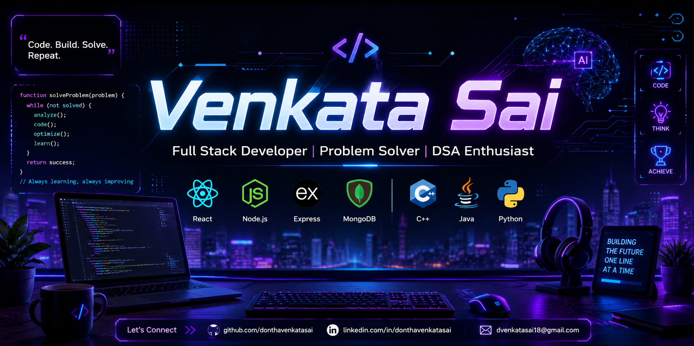

# VENKATA-SAI

  

<h1 align="center">Hi 👋, I'm Venkata Sai</h1>
<h3 align="center">Full Stack Developer | DSA Enthusiast | Problem Solver</h3>

  

---

## 🚀 About Me

- 🌱 Currently learning MERN Stack
- 💻 Solving DSA problems daily
- 🤝 Looking to collaborate on Open Source Projects
- ⚡ Interested in Web Development & AI

---

## 🛠️ Tech Stack

---

## Connect With Me

LinkedIn: https://www.linkedin.com/in/venkatasai100904/

LeetCode: https://leetcode.com/u/donthavenkatasai/

Email: dvenkatasai18@gmail.com

---
